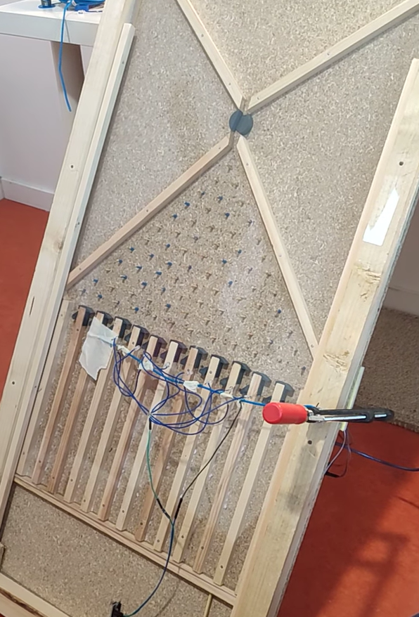
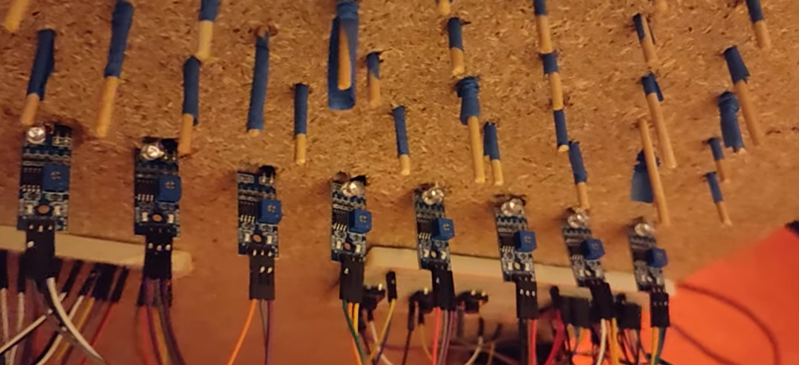
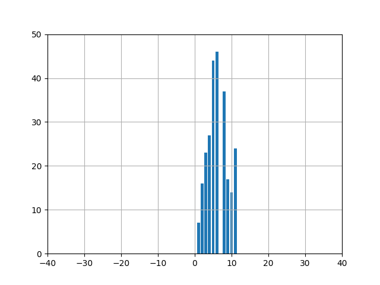
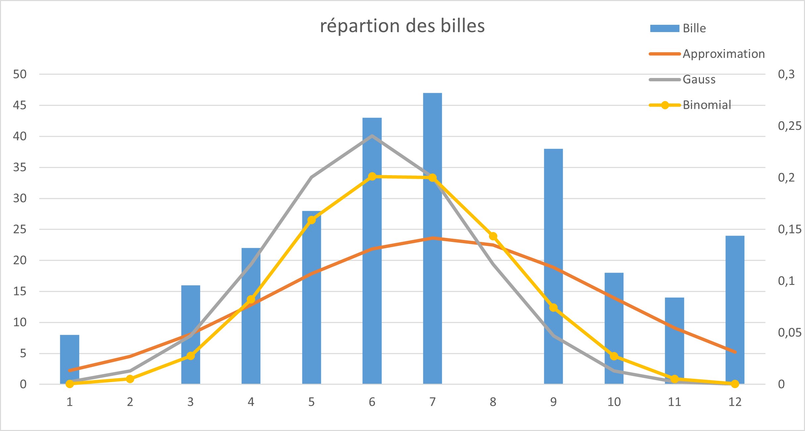

# 🎲 Automated Galton Board

This project is a group effort aiming to build an **automated Galton Board**.  
The system is designed to automatically release balls, detect their path through different channels, and collect statistical data for visualization and analysis.
 

  
  
  
  
  

---

## 📖 Overview

- **Structure:** Mechanical frame of the Galton Board (built by the team).  
- **Automation & Control (my contribution):**  
  - Stepper motor controlled by Arduino to release balls.  
  - Custom-designed 3D-printed gate to regulate ball release.  
  - Infrared sensors at each channel to count the number of balls.  
  - Arduino acquisition of sensor data, transmitted via serial port.  
  - Python script to process data in real time with Matplotlib and store results in CSV for further analysis (Excel).  

---

## 🛠️ Hardware & Software

### Hardware
- Arduino (control unit)  
- Stepper motor with driver  
- 3D-printed gate (custom-designed and modeled)  
- Infrared sensors (ball detection)  
- Galton Board structure (provided by the team)  

### Software
- **Arduino**:  
  - Controls the stepper motor  
  - Reads infrared sensors  
  - Sends ball count data via serial port  

- **Python**:  
  - Reads data from Arduino through serial communication  
  - Real-time visualization with Matplotlib  
  - Stores results in CSV for later processing in Excel  

---

## 🏗️ System Architecture

1. **Ball Release Mechanism**  
   - Controlled by a stepper motor + 3D-printed gate  
   - Automated ball release at controlled intervals  

2. **Detection & Counting**  
   - Infrared sensors detect balls in each channel  
   - Data collected by Arduino  

3. **Data Processing & Visualization**  
   - Python script reads serial data from Arduino  
   - Real-time chart updates with Matplotlib  
   - Data logged into CSV for statistical analysis in Excel 

      